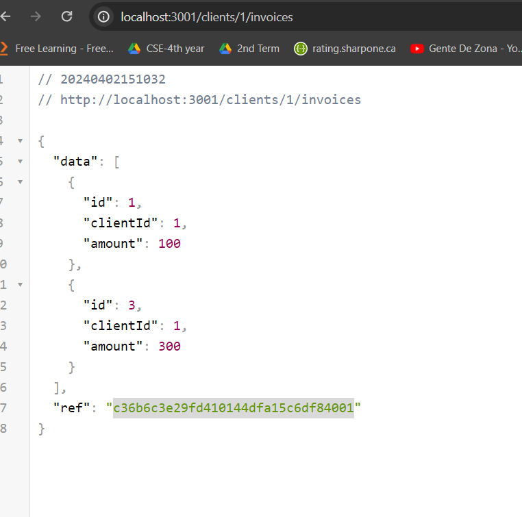
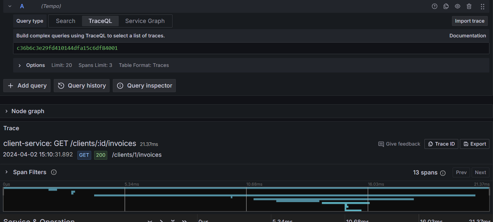
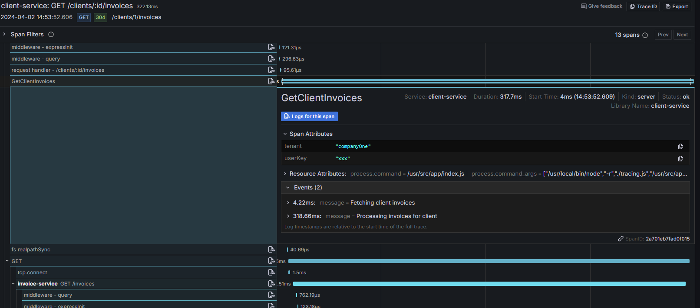
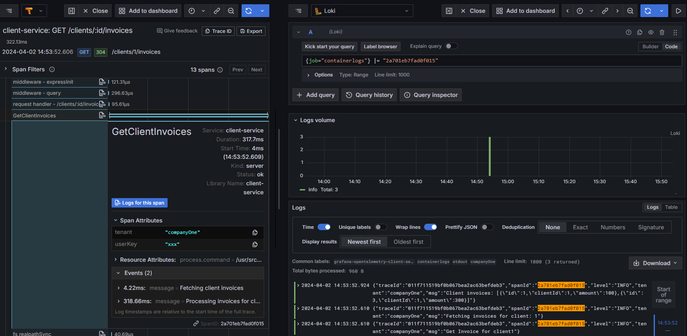
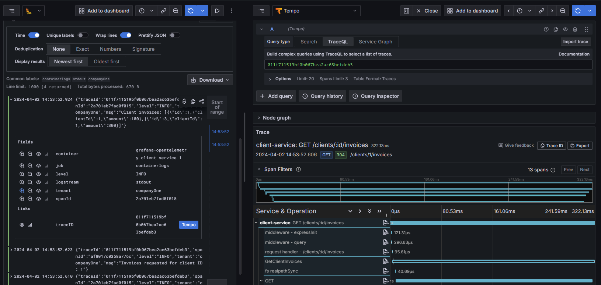

# grafana-opentelemetry

## Introduction

This repository contains a set of Grafana dashboards that are designed to work with the OpenTelemetry Collector in NodeJs Services.

## Installation

to run the Grafana dashboards, and nodeJs services, you need to have Docker installed on your machine.

```bash
docker compose up -d
```

## Proof of Concept

This POC to try to build an auditing system or a monitoring system for NodeJs services using OpenTelemetry Collector and Grafana.

The output scope is to trace the request lifecycle from the beginning to the end, and to monitor the services' performance. i need to show the timeline of the request in one trace. the if the request calls another service, i need to show the timeline of the request in the same trace. the trace should includes

- The request (Trace) start time, and end time
- The request (Trace) related Logs (All Spans Logs)
- The request's stages/segments (Spans) in the request
  - Services communications (Spans) in the request
  - Stages (Spans) start time, and end time
  - Stages (Spans) metadata (Attributes). i.e. tenant name, userId, ...etc.
  - Stages (Spans) Events (Breakpoints to show the stage lifecycle)
  - Stages (Spans) Statues (Success, Fail with error message)
  - Stages (Spans) related Logs
    - Show All logs and allow to filter by log level, and tenant
    - Each Log linked with the related trace


### Service communication

  curl http://localhost:3001/clients/1/invoices

  client-service -> invoice-service -> client-service  (One Trace)

 
### Try it

- **`docker compose up -d`**
- **curl http://localhost:3001/clients/1/invoices and in the response get the value of `ref`. `ref` is the `traceId`**



============================================================

- **Open Grafana http://localhost:3000 and login with `admin`/`admin`**
  - **Go to the `Explore` tab and select `Tempo` datasource**
  - **search b traceId in `TraceQL`**

  

  ==========================================================

    - **you will show all spans related to the traceId**
    - **you will find in each span attributes and events**

    

  ==========================================================

    - **to show related logs, press on the `Logs for this span` button in the span to show logs in loki**

    

  ==========================================================


  - **Go to the `Explore` again tab and select `Loki` datasource**
   - **In the `Label filters` you can filter by `tenant` or `level`**
   - **If you press on the log message, you will find a button called `Tempo` to show the related trace**
   
   


